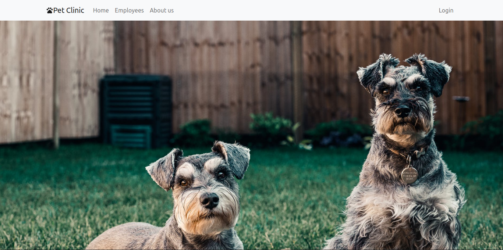
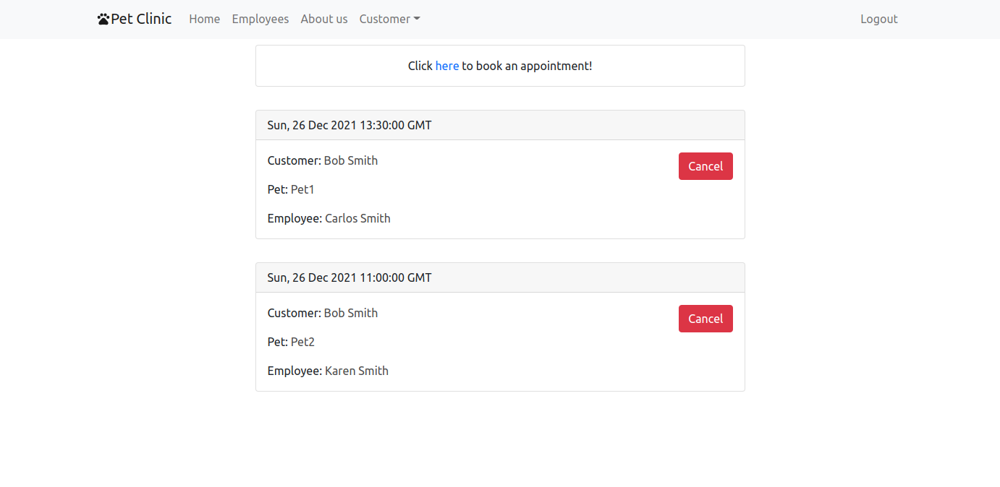
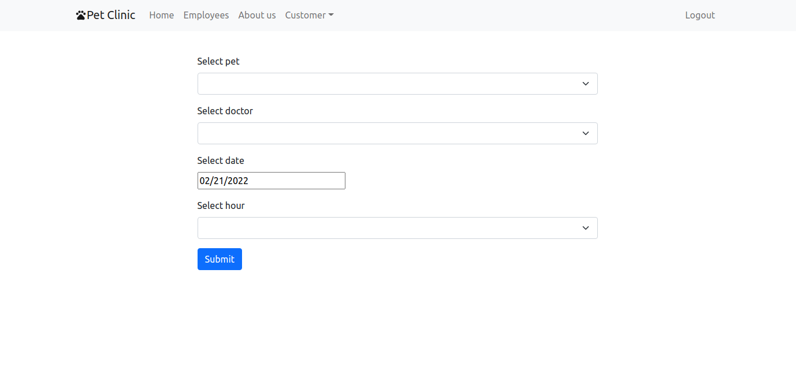
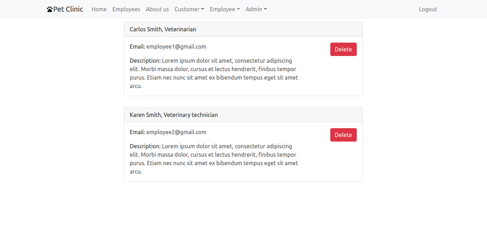

# Pet Clinic

## Table of Contents
  - [Description](#description)
  - [Technologies](#technologies)
  - [Endpoints](#endpoints)

## Description
Pet Clinic is full stack project made becouse of my own intentions. App is used to manage pet clinic by using a browser. There are 3 distinguishable roles - customer, employee and admin. 

Customer can:
- Add pet to his pet list.
- Delete pet from his pet list.
- Book an appointments with chosen pet and doctor.
- Cancel an appointment.

Employee can:
- See his appointments.
- Manage his appointments.

Admin can:
- Likely everything :) (things like deleting entities, adding entities etc.)

## Technologies
### Back-end
* PostgreSQL
* Java 17
* Spring 
### Front-end
* React library for JS

## Endpoints
Here are some of the endpoints examples:

`/home`
This is a home view if you are not logged in.

`/appointments/customer`
Here customer can see all his booked appointments.

`/appointments/book`
Here customer can book an appointment.

`/appointments/customer`
Here admin can see all employees in database and manage them.

